<p align="center">
  
</p>

# KeepSake - The Personal Vault
### Project Description:
KeepSake is a personal vault manager that lets you store and manage different kinds of data, like Passwords, Identity Cards, etc, in an encrypted format.

The Project also utilizes GUI which provides you with a simple and easy-to-use interface.
 
## Table Of Contents:
1. [Features](#features)
2. [Working](#working)
    1. [Login Screen](#login-screen)
    2. [Personal Vault](#personal-vault)
    3. [Adding an Item](#adding-an-item)
    4. [Categories](#categories)
    5. [Operations on Individual Items](#operations-on-individual-items)
        1. [View](#view)
        2. [Edit](#edit)
        3. [Delete](#delete)
    6. [Settings](#settings)
    7. [Administrator Account](#administrator-account)
3. [Installation](#installation)
    1. [Prerequisites](#prerequisites)
    2. [Running The Project](#running-the-project)
4. [Credits](#credits)
5. [License](#license)

## Features:
1) All data is encrypted which ensures your data can not be easily accessed.
2) All functionality is very simple and doesn't require extensive knowledge
3) Utilizes Qt GUI Library letting you store and retrieve all your data without having to learn any commands.
4) Administrator accounts with additional functionalities like changing user passwords on demand.
5) Categories that let you quickly access a specific type of item instead of having to search through all of them.

## Working:
### Login Screen:
When you first start the application you are presented with a login screen, you can either create a new account, or login to an existing one. If you are an Administrator, you can also click the Admin button and log into your Administrator account.

<p align="center">
  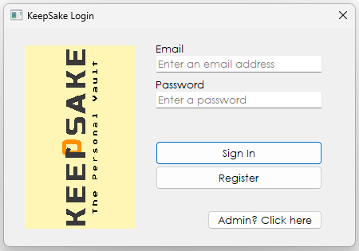
</p>

### Personal Vault:
After logging in, you are presented with your personal vault. here you can add an item, choose a category, or go to settings.

<p align="center">
  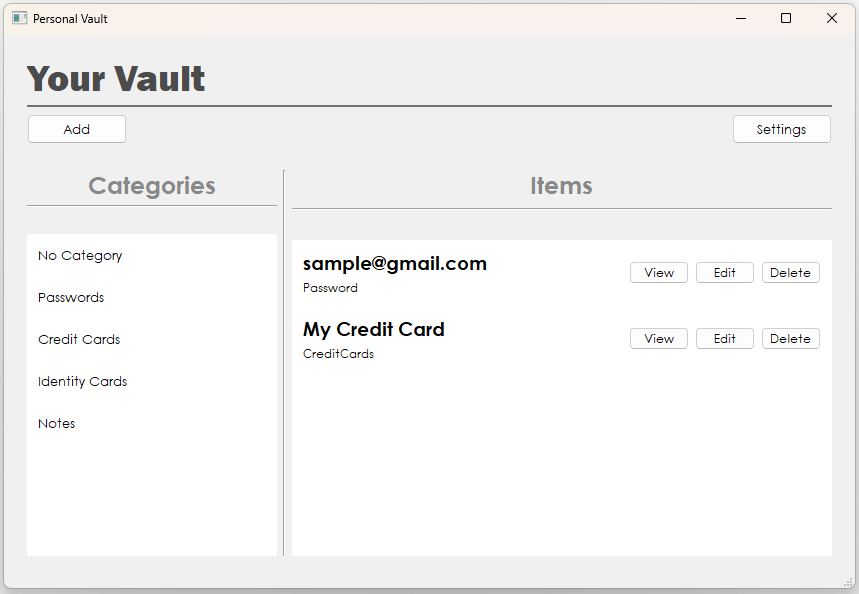
</p>

### Adding an Item:
When you click add, you are presented with a view to select different kinds of items. Once you click an option, you can enter a title and other relevant data, then after clicking Enter, your data is stored in the vault.

<p align="center">
  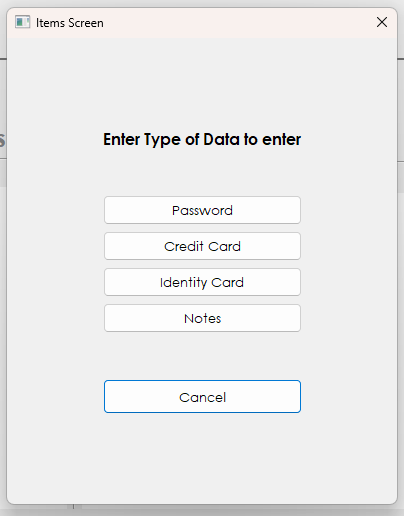
</p>

If you select a Password data type, you also get the option to generate a random password of a specified length which can include symbols as well.

<p align="center">
  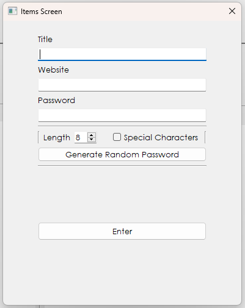
</p>

### Categories:
If you have a lot of items in your vault, it can be difficult to navigate to a specific one, therefore you can select a category from a list of categories on the left-hand side, this will allow you to view only items belonging to that specific data type so you can much more easily find your items.

<p align="center">
  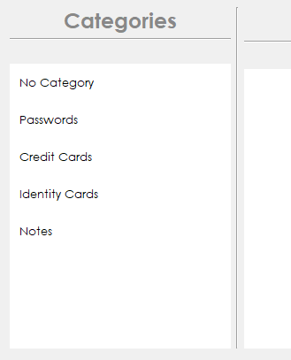
</p>

### Operations on Individual Items:
There are 3 different operations you can perform on every single data item.

<p align="center">
  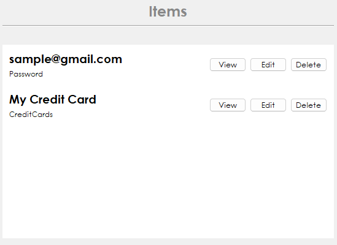
</p>

#### View:
Allows you to view the data you have entered.

<p align="center">
  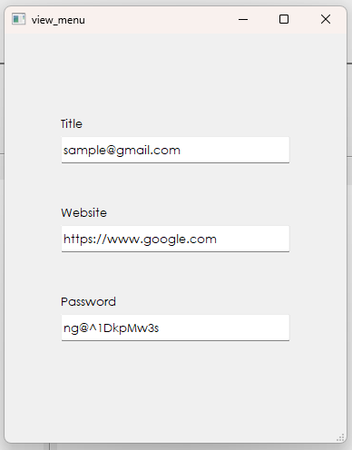
</p>

#### Edit:
Allows you to change your data (for example changing the title, or changing your password).

<p align="center">
  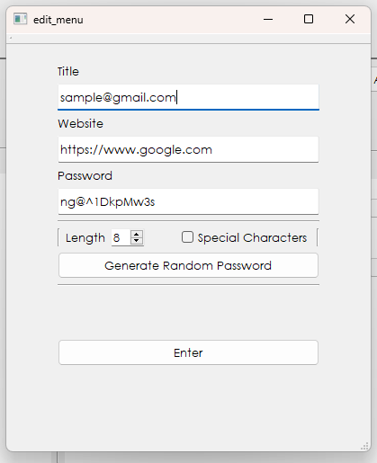
</p>

#### Delete:
If you no longer need a specific data item, you can easily delete it.

<p align="center">
  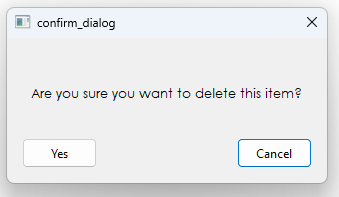
</p>

### Settings:
This window allows you to change your email and password. It also allows you to log out which will store you data in encrypted form and log you out.

<p align="center">
  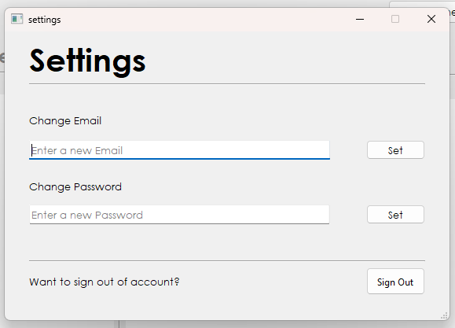
</p>

### Administrator Account:
If you signed in as an administrator, you will have an Admin panel, this will let you change individual users password yourself by providing an email and the new password.

<p align="center">
  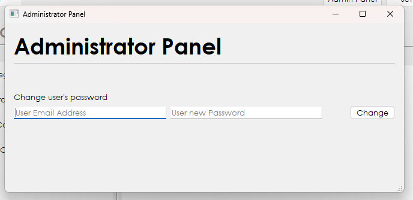
</p>

## Installation:

### Prerequisites:
- Having a working install of **Qt** (Project was built using Qt 6.63)
- Having installed **Visual Studio Community** with the **"Desktop Development with C++"** module installed (Project was built using Visual Studio Community 2022)
- Having installed the **"Qt Visual Studio Tools"** extension inside Visual Studio Community and set it up with your installed Qt program.

### Running The Project:
1. Clone the repository into your desired folder using:
```
https://github.com/Affan-Mushahid/KeepSake.git
```

2. Open the **KeepSake.sln** file.
> [!Important]
> If you're running Visual Studio Community Version other than 2022, You might have to right-click the Project > Properties > General > Platform Toolset and change it to your version of Visual Studio Community.
3. Build and Run the Project.

## Credits:
1. [Affan Mushahid](https://github.com/Affan-Mushahid)
2. [Hareem Aqeel](https://github.com/hareem-aqeel)
3. [Atika Ali](https://github.com/atika-ali)
4. [Maryam Kamal](https://github.com/maryam01k)

## License:
KeepSake is a personal vault manager that lets you store and manage different kinds of data

Copyright (C) 2024 Muhammad Affan Mushahid, Hareem Aqeel, Atika Ali, Maryam Kamal

This program is free software: you can redistribute it and/or modify
it under the terms of the GNU General Public License as published by
the Free Software Foundation, either version 3 of the License, or
(at your option) any later version.

This program is distributed in the hope that it will be useful,
but WITHOUT ANY WARRANTY; without even the implied warranty of
MERCHANTABILITY or FITNESS FOR A PARTICULAR PURPOSE.  See the
GNU General Public License for more details.

You should have received a copy of the GNU General Public License
along with this program.  If not, see <https://www.gnu.org/licenses/>.
